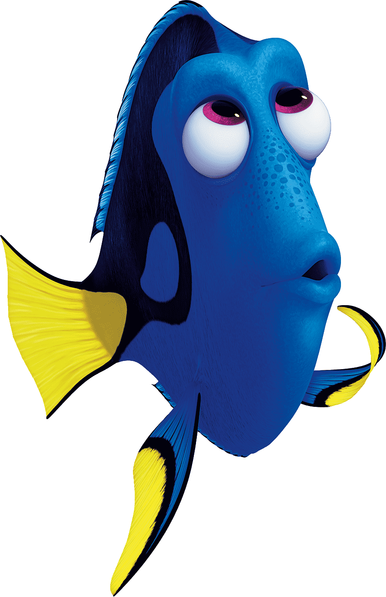

```{r setup, include=FALSE}
knitr::opts_chunk$set(echo = TRUE)

library(robis)

```

## Acesso a bancos de dados abertos

O acesso pode ser feito de diferentes formas, seja diretamente no website do repositório, utilizando-se pacotes específicos que acessam os repositórios via R ou Python, ou através de API (Application Programming Interface). Nesta última opção, o repositório é acessado por outro aplicativo ou serviço web para automatização de tarefas, seja em servidor local ou remoto, mas requer conhecimento de programação em Java e outras linguagens e não será tratado aqui.
 
Nesta atividade, temos como objetivo acessar um repositório de dados de ocorrência de espécies, inspecionar os dados, avaliar sua qualidade e fazer um mapa com as ocorrências.

 
Para iniciar, vamos escolher um repositório e uma espécie de interesse. Vamos iniciar com uma única espécie para facilitar as demais etapas. 

O [GBIF (*Global Biodiversity Information Facility*)](https://www.gbif.org/) é o maior repositório de ocorrências da biodiversidade da atualidade, então será nossa opção de repositório. No entanto, o [OBIS (*Ocean Biodiversity Information System*)](https://obis.org/) é um repositório dedicado às espécies marinhas e espelhado no GBIF. Assim, espera-se que algumas ocorrências sejam duplicadas nos dois repositórios.


### Exemplo: *Finding Dori*

A espécie-alvo será o peixe marinho *Paracanthurus hepatus*, também conhecido como *Blue Tang* e, mais recentemente como **Dori**!.

<center></center>

Nosso primeiro exemplor será com as ocorrencias do **GBIF** e, para tal, vamos utilizar o pacote `rgbif`.

***

### **GBIF**
Vamos fazer uso do pacote `tidyverse` para manipular dos dados, então vamos carregar este pacote e o `rgbif`.

```{r pacotes, echo = FALSE}

library(rgbif)
library(tidyverse)

```

É importante explorar as funções do pacote e pode-se fazer isto usando o comando `?rgbif` e, para ler sobre uma função em particular basta colocar `?` em frente ao nome da função. Se o pacote não estiver carregado ou instalada é preciso usar `??`.

A função `occ_data` faz uma busca simplificada das ocorrências no repositório do **GBIF** por meio do nome científico, número de identificação, país e outros. Neste caso, vamos procurar diretamente pelo nome da espécie-alvo. Outros atributos podem ser adicionados à função para refinar a busca, leia o material de ajuda da função para ter uma ideia. Vamos aproveitar alguns destes atributos e selecionar apenas ocorrências que possuem coordenadas e sem problemas geoespaciais.

```{r gbif}

# checar funcoes
?occ_data

# baixar ocorrencias
dori_gbif <- occ_data(scientificName = "Paracanthurus hepatus", 
                      hasCoordinate = TRUE,
                      hasGeospatialIssue=FALSE)

# dimensoes
dim(dori_gbif)

dim(dori_gbif$data)

# checar campos
dori_gbif$data %>% names

```

Acima, vemos que o conjunto de dados tem `r nrow(dori_gbif)` ocorrências (uma por linha) e `r ncol(dori_gbif)` variáveis. As variáveis podem ser utilizadas para filtrar as ocorrências de acordo com o objetivo, além de fornecerem diversos dados a respeito das ocorrências, incluindo dados dos amostradores e detentores dos direitos.
Vale notar que o conjunto de dados retornado pelo **GBIF** não é um `data frame` simples, mas sim um `list` que contém um conjunto de `data frames`. Para acessar estes `data frames` é necessário usar o operador `$`.


## Problemas reportados

Um dos campos mais úteis dos dados é a coluna `issues`, pois ela indica problema já identificados pelo validador automático do repositório. Os problemas (*issues*) possuem um código que pode ser conferido pela função `gbif_issues`. Ao usar a função não é preciso indicar nenhum atributo, pois ela retornará um dataframe com as abreviações usadas e a descrição dos problemas catalogados no GBIF. 


```{r issues, echo=FALSE}

# check issues
gbif_issues() 

```

Para checar os `issues` indicados na base baixada é necessário um pequeno tratamento, uma vez que algumas ocorrências possuem múltiplos problemas. Assim, utilizamos a função `strsplit` para individualizar os `issues` e poder conferí-los.

```{r issues1, echo=FALSE}

# checar problemas reportados
issues_gbif <- dori_gbif$data$issues %>% 
  unique() %>% 
  strsplit(., "[,]") %>% 
  unlist()

gbif_issues() %>% 
  data.frame() %>% 
  filter(code %in% issues_gbif)

```

A maioria dos problemas reportados é relacionado com discrepancias entre informações indicadas pelos autores e as levantadas pelo algoritmo de checagem, mas nenhum parece invalidar as ocorrências, por enquanto.

Prosseguimos selecionando algumas variáveis que serão úteis para a validação dos dados e futuras análises, como coordenadas, profundidade, nome da base de dados etc.

```{r}

dori_gbif1 <- dori_gbif$data %>%
  dplyr::select(scientificName, acceptedScientificName, decimalLatitude, decimalLongitude,
         issues, waterBody, basisOfRecord, occurrenceStatus, rightsHolder, 
         datasetName, recordedBy, depth, locality, habitat) 

```

Note que temos `r nrow(dori_gbif1)` ocorrências, no entanto, vamos ver quantas são únicas aplicando a função `distinct` do pacote `dplyr`.

```{r}

dori_gbif1 <- dori_gbif1 %>% 
  distinct() 

```

No fim, observamos que ficamos com `r nrow(dori_gbif1)` ocorrências agora, e isso acontece por causa de diferenças em colunas que, neste caso, não serão usadas para o objetivo desta prática. 

Para identificar todos os valores únicos presented nos dados, vamos aplicar a função `unique` a cada coluna com um *loop* na função `lapply`.

```{r}

# checar niveis dos fatores
lapply(dori_gbif1, unique)

```

## Problemas não reportados

Agora iniciamos o processo de checagem mais fina que não é realizada pelo algoritmo, por apresenta especificidades que vão além de sua programação.
Podemos iniciar checando a distribuição das ocorrências em relação às regiões oceanográficas indicadas nos dados (`waterBody`).

```{r}

# investigar niveis suspeitos
dori_gbif1 %>% 
  distinct(waterBody) %>% 
  pull()

# waterBody
dori_gbif1 %>%
  group_by(waterBody) %>% 
  summarise(occ = length(scientificName)) %>% 
  ggplot(aes(occ, y=waterBody)) +
    geom_bar(stat = 'identity') 

```

Aparentemente, esta espécie tem sido reportada no mundo todo.
Com o sucesso da animação *Procurando Nemo*, já temos uma ideia de que a **Dori** tem ocorrência nas águas Australianas, mas podemos acessar bancos de dados especializados para checar estas informações. No caso de peixes (Osteichthyes e Chondrichthyes) o [*FishBase*](https://fishbase.org) é a fonte mais atualizada de informações deste grupo.
Depois desta confirmação, podemos suspeitar das ocorrências indicadas no Atlântico e, o tratamento mais rigoroso é a exclusão de qualquer ocorrência suspeita.

```{r}

# fonte das regioes erradas
dori_gbif1 %>% 
  filter(waterBody %in% c("Atlantic Ocean", "Carribean", "Royal Caribbean", "Carribean Sea", "Bonaire")) %>% 
  distinct(datasetName)

```

Alguma característica destas ocorrências do Atlântico podem dar pistas de como continuar filtrando os resultados. Neste caso, abaixo podemos ver que, ao investigarmos um programa de ciência específico de identificação realizada por mergulhadores amadores, notamos que este concentra a maior parte das suspeitas. Assim, é melhor ser conservador e remover todas as ocorrências associadas a tal programa.

```{r}

# 25 ocorrencias
dori_gbif1 %>% 
  filter(datasetName %in% c("Diveboard - Scuba diving citizen science"))

# filtrar todas do dataset suspeito
dori_gbif_ok <- dori_gbif1 %>% 
  filter(!datasetName %in% c("Diveboard - Scuba diving citizen science"))

```

Agora não vemos mais nenhuma ocorrência no Atlântico!

```{r}

library(ggmap)
library(maps)
library(mapdata)

# checar pontos
 
ggplot() +
  geom_polygon(data = world, aes(x = long, y = lat, group = group)) +
  coord_fixed() +
  theme_classic() +
  geom_point(data = dori_gbif_ok, aes(x = decimalLongitude, y = decimalLatitude), color = "red") +
  labs(x = "longitude", y = "latitude", title = expression(italic("Paracanthurus hepatus")))

```

Podemos usar a profundidade como outro critério, pois esta espécie é associada apenas a recifes rasos segundo o **FishBase**. E parece tudo ok.

```{r}

# checar profundidade
dori_gbif_ok %>% 
  ggplot(aes(x = depth, fill = waterBody)) +
    geom_histogram() 

```

***

### **OBIS**

Agora vamos fazer os mesmos procedimentos com os dados do **OBIS**, utilizando o pacote `robis` e a função `occurrence` deste pacote.

1. Baixar as ocorrências
```{r}

## OBIS
dori_obis <- robis::occurrence("Paracanthurus hepatus")

```

2. Checar os dados

Temos variáveis com os mesmos nomes, pois ambos usam o sistema `DwC`, mas os problemas reportados neste caso são indicados na coluna `flags`.

```{r}

# checar dados
names(dori_obis)

dori_obis1 <- dori_obis %>% 
  dplyr::select(scientificName, decimalLatitude, decimalLongitude, bathymetry,
         flags, waterBody, basisOfRecord, occurrenceStatus, rightsHolder, 
         datasetName, recordedBy, depth, locality, habitat) %>% 
  distinct()

# check problemas reportados (flags)
dori_obis1 %>% 
  distinct(flags)

# check NA em datasetName
dori_obis1 %>% 
  filter(!flags %in% c("no_depth,on_land", "on_land", "on_land,depth_exceeds_bath", "depth_exceeds_bath,on_land"),
         is.na(datasetName)) %>% 
  distinct(waterBody)

```

Aqui usamos as `flags` para filtrar ocorrências em terra, além de remover dados sem nome de *dataset* (não temos como checar a origem adequadamente, então podemos tratar como suspeitos), filtrar ocorrências no Atlântico e verificar a profundidade reportada.

```{r}

# depth ok
dori_obis1 %>% 
  filter(!flags %in% c("no_depth,on_land", "on_land", "on_land,depth_exceeds_bath", "depth_exceeds_bath,on_land"),
         !is.na(datasetName),
         !waterBody %in% c("North America", "North America Atlantic", "atlantique")) %>% 
  ggplot(aes(x = depth, fill = waterBody)) +
    geom_histogram() 

# checar niveis
dori_obis1 %>% 
  filter(!flags %in% c("no_depth,on_land", "on_land", "on_land,depth_exceeds_bath", "depth_exceeds_bath,on_land"),
         !is.na(datasetName),
         !waterBody %in% c("North America", "North America Atlantic", "atlantique")) %>% 
  lapply(., unique)

# ok
dori_obis_ok <- dori_obis1 %>% 
  filter(!flags %in% c("no_depth,on_land", "on_land", "on_land,depth_exceeds_bath", "depth_exceeds_bath,on_land"),
         !is.na(datasetName),
         !waterBody %in% c("North America", "North America Atlantic", "atlantique", NA)) 

```

Podemos usar um mapa para verificar melhor as ocorrências também.

```{r}

# check
ggplot() +
  geom_polygon(data = world, aes(x = long, y = lat, group = group)) +
  coord_fixed() +
  theme_classic() +
  geom_point(data = dori_obis_ok, aes(x = decimalLongitude, y = decimalLatitude, color = waterBody)) +
  #theme(legend.title = element_blank()) +
  labs(x = "longitude", y = "latitude", title = expression(italic("Paracanthurus hepatus")))

```

Parece tudo ok, e chegamos a `r nrow(dori_obis_ok)` ocorrências potenciais.

Por fim, vamos unir todas as ocorrências, checar se existem duplicatas e plotar o resultado final.

```{r}

# unir GBIF e OBIS

rm(list = setdiff(ls(), c("dori_obis_ok", "dori_gbif_ok")))

# ver diferencas
setdiff(names(dori_gbif_ok), names(dori_obis_ok))
setdiff(names(dori_obis_ok), names(dori_gbif_ok))

all_data <- bind_rows(dori_gbif_ok %>% 
                        mutate(repo = paste0("gbif", row.names(.))), 
                      dori_obis_ok %>% 
                        mutate(repo = paste0("obis", row.names(.)))) %>%
  column_to_rownames("repo") %>% 
  dplyr::select(decimalLongitude, decimalLatitude, depth) %>% 
  distinct() %>% 
  rownames_to_column("occ") %>% 
  separate(col = "occ", into = c("datasetName", "rn"), sep = 4) %>%
  mutate(scientificName = "Paracanthurus hepatus") %>% 
  dplyr::select(-rn)


# mapear ocorrencias
ggplot() +
  geom_polygon(data = world, aes(x = long, y = lat, group = group)) +
  coord_fixed() +
  theme_classic() +
  geom_point(data = all_data, aes(x = decimalLongitude, y = decimalLatitude, color = datasetName)) +
  #theme(legend.title = element_blank()) +
  labs(x = "longitude", y = "latitude", title = expression(italic("Paracanthurus hepatus")))

```
<br><br>


O último passo é guardarmos os dados baixados e tratados para economizar tempo no próximo uso, mas o mais importante já está registrado, o passo-a-passo de como chegamos até os dados usados nas análises.

```{r dados}

write.csv(all_data, "data/occ_GBIF-OBIS_par_hepa.csv", row.names = FALSE)

```


### EXTRA: Classificação automática de pontos

#### Função 'caseira'
Podemos usar outras ferramentas mais refinadas para nos ajudar a detectar ocorrências suspeitas, como as encontradas nos pacotes `CoordinateCleaner`, `obistools`, `scrubr` e `biogeo`. Além disso, podemos criar nossas próprias funções para auxiliar nessa tarefa.

Abaixo, vamos utilizar os dados baixados do `GBIF` antes da limpeza já realizada acima. Aqui vou começar a exemplificar com uma função simples criada por mim. Esta função utiliza as coordenadas para calcular o centróide (ponto médio de todas as ocorrências) e, a partir dele, a distância de cada ponto até o centróide. Esse princípio se baseia em propriedades de conectividade de populações contíguas, então quanto mais distantes (neste caso as muito distantes) maior a chance de termos uma ocorrência suspeita da mesma espécie. *Atenção: isso é apenas uma ferramenta para classificar as ocorrências! A decisão de filtrar ou não os pontos suspeitos vai depender do seu conhecimento ou da literatura a respeito dos habitats e regiões de ocorrência da espécie-alvo*.

Inicialmente, vamos carregar a função `flag_outlier` que está em uma rotina auxiliar separada usando a função `source`. E, em seguida, aplicaremos a função e vamos plotar um mapa para avaliar as ocorrências com *flag* de *outlier*. 

```{r}

source('functions/aux_functions.R')

# classificar ocorrências
marcados <- dori_gbif$data %>% 
  data.frame() %>% 
  dplyr::select(scientificName, decimalLongitude, decimalLatitude, datasetName) %>% 
  distinct() %>% 
  flag_outlier(., "Paracanthurus hepatus (Linnaeus, 1766)")
  
# mapa
ggplot() +
    geom_polygon(data = world, aes(x = long, y = lat, group = group)) +
    coord_fixed() +
    theme_classic() +
    geom_point(data = marcados, 
               aes(x = decimalLongitude, y = decimalLatitude, 
                   color = flag)) +
    theme(legend.title = element_blank()) +
    labs(x = "longitude", y = "latitude", 
         title = expression(italic("Paracanthurus hepatus")))

```
<br><br>

Podemos notar no mapa acima que as ocorrencias acima do 90ésimo quantil são muito similares às já filtradas acima com base no `waterBody`, mas se já não tivéssemos a informação da ocorrência restrita da espécie ao Indo-Pacífico, já poderíamos desconfiar destas ocorrências tão longe, os *outliers*. Investigando o datasetName destas ocorrências com *flags* também chegaríamos a mesma conclusão de excluir os dados associados ao `Diveboard - Scuba diving citizen science` e sem valor de `datasetName`.
<br><br>


#### Pacote `scrubr`

O pacote `scrubr` possui algumas funções úteis para indicar problemas com coordenadas com elementos faltantes (`coord_incomplete`), coordenadas impossíveis (`coord_impossible`) e coordenadas duplicadas (`dedup`). Este último é estimado em um raio de tolerância e mais útil para análises em escala mais grosseira ou quando o informações a serem correlacionadas estão em escala maior. Podemos inclusive aplicá-las sequencialmente, pois o padrão das funções é excluir as ocorrências suspeitas, mas **não recomendo seguir cegamente métodos automáticos de exclusão de dados!**

```{r scrubr}

# usando os dados com flag
data_scrubr <- marcados %>% 
  dframe() %>% 
  coord_impossible() %>% 
  coord_incomplete() %>% 
  coord_unlikely() %>% 
  dedup()


# mapa
ggplot() +
  geom_polygon(data = world, aes(x = long, y = lat, group = group)) +
  coord_fixed() +
  theme_classic() +
  geom_point(data = data_scrubr, 
               aes(x = decimalLongitude, y = decimalLatitude), 
                   color = "red") +
  geom_point(data = marcados %>% 
                 filter(flag != "OK"), 
               aes(x = decimalLongitude, y = decimalLatitude), 
                   color = "blue", shape = 3) +
    theme(legend.title = element_blank()) +
    labs(x = "longitude", y = "latitude", 
         title = expression(italic("Paracanthurus hepatus")))

```
<br><br>


Note que as ocorrências indicadas com uma cruz foram mantidas pelo `scrubr`, e isso reforça o papel de quem analisa em julgar os pontos suspeitos.
<br><br>


#### pacote `obistools`

Vale lembrar que o `OBIS` é um repositório de dados marinhos, então as ferramentas tem melhor uso para dados desta natureza. Inclusive uma das funções do pacote (`check_onland`) checa coordenadas em terra, sejam ilhas ou continentes.
Aqui vamos testar a função `check_outliers_species` que tem um princípio semelhante à nossa função caseira `flag_outliers`, mas é baseada no **median absolute deviation (MAD)** e no **interquartile range (IQR)**, parâmetros que podem ser ajustados na função.


```{r}

library(obistools)

dori_obis %>% 
  dplyr::select(decimalLongitude, decimalLatitude, scientificNameID) %>% 
  distinct() %>% 
  check_outliers_species(., report=TRUE)


# usando essa configuração chegamos a valores próximos aos da limpeza manual
dori_obis %>% 
  dplyr::select(decimalLongitude, decimalLatitude, scientificNameID) %>% 
  distinct() %>% 
  check_outliers_dataset(., report = FALSE, iqr_coef = 1, mad_coef = 5) %>% 
  dim()

```
<br><br>


```{r}

ggplot() +
    geom_polygon(data = world, aes(x = long, y = lat, group = group)) +
    coord_fixed() +
    theme_classic() +
    geom_point(data = marcados %>% 
                 filter(flag != "OK"), 
               aes(x = decimalLongitude, y = decimalLatitude, 
                   color = datasetName)) +
    theme(legend.title = element_blank()) +
    labs(x = "longitude", y = "latitude", 
         title = expression(italic("Paracanthurus hepatus")))

```
<br><br>

Por fim, vamos testar o pacote `CoordinateCleaner`. Nele devemos especificar os campos correspondentes na função `clean_coordinates`.

```{r}

library(CoordinateCleaner)

flags <-
  clean_coordinates(
    x = marcados,
    lon = "decimalLongitude",
    lat = "decimalLatitude",
    species = "scientificName",
    tests = c("equal", "gbif",
              "zeros", "seas")
  )

```
<br><br>

Neste caso, nenhuma ocorrência foi marcada como suspeita. Moral da história, sempre temos que conferir todos os dados, mas as ferramentas ajudam muito nesta tarefa!


