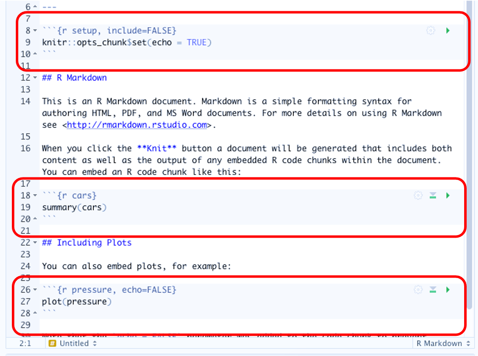
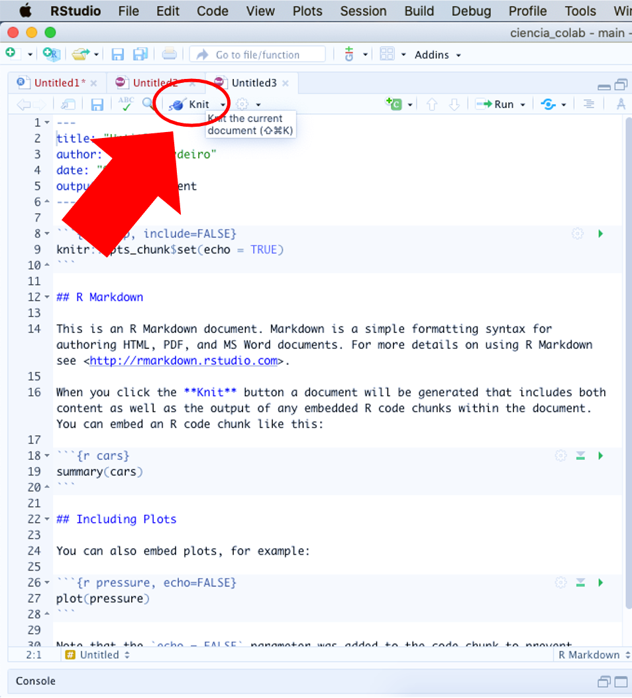
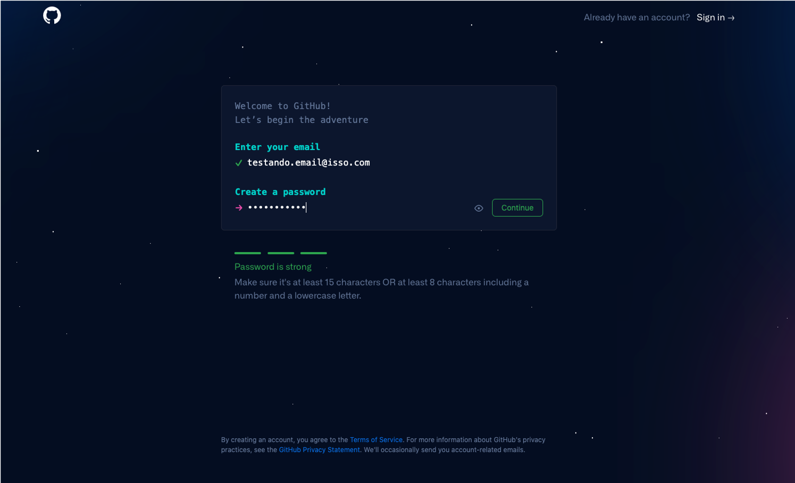
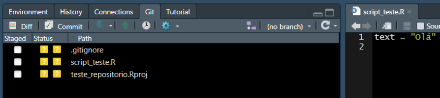
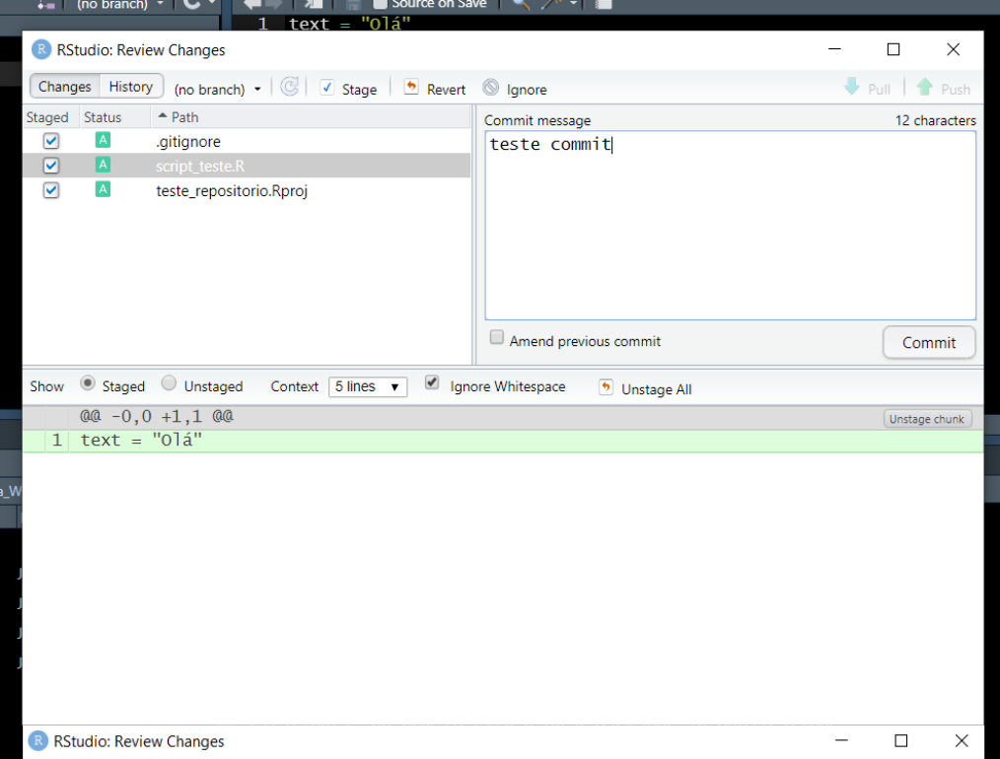
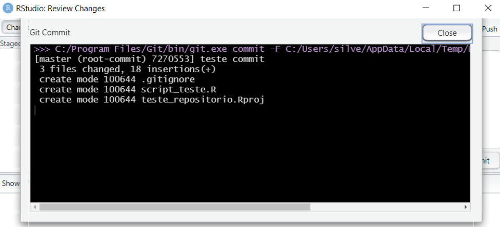
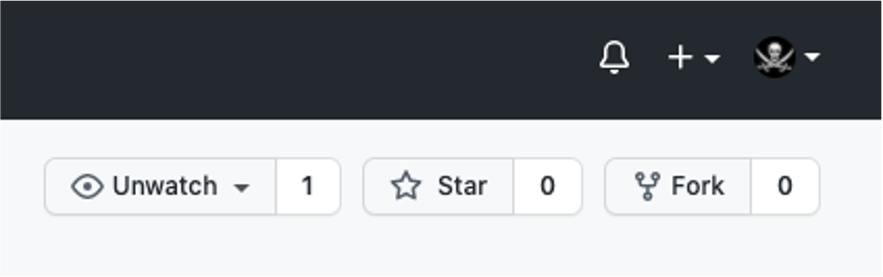

```{r setup, include=FALSE}
knitr::opts_chunk$set(echo = TRUE)

library(tidyverse)
library(ggmap)
library(maps)
library(mapdata)

```

# Atividade 4 {.unnumbered}

A atividade 4 vai incluir algumas subatividades para podermos interagir com as atividades anteriores e inserir algumas novas ferramentas.
<br><br>

## R Markdown

A primeira parte da atividade consiste em tranformar a rotina criada na [atividade 3](atividade3.html) em um formato mais amigável de ser compartilhado. Muitas vezes criamos o próprio estilo ao construir rotinas e deixamos alguns detalhes e explicações de lado. No entanto, para que outras pessoas possam construir em conjunto é importante que todos os detalhes estejam descritos na rotina. Os documentos no formato `markdown` permitem mesclar trechos de texto com códigos, o que facilita muito a explicação dos passos utilizados para criarmos documentos, explicar o racional de análises em uma pesquisa, produzir conteúdo didático e outros.
Quando já entendemos o formato `R Markdown` iremos iniciar todo o processo já construindo este documento e não transferindo o código como iremos fazer aqui. Esse método foi escolhido para mostrar que além de podermos criar de maneira mais organizada nossas futuras rotinas, podemos lidar com um 'passivo' das rotinas associadas a trabalhos mais antigos para podermos nos organizar melhor, e aprender no caminho.

Os passos aplicados aqui serão os mesmos para começar um documento do zero ou para fazermos essa transferência proposta no exercício.
<br><br>

  + O primeiro passo é criar um documento R Markdown no RStudio. Para isso, clique no menu `File` -> `New file` -> `R Markdown`.

<center></center>
<br><br>

  + Em seguida, escolhemos o tipo de *output* (vamos usar o padrão HTML), dar um nome ao arquivo (**atividade4**) e clicar em `OK`.
  
<center></center>
<br><br>

  + O documento criado já apresenta um exemplo com o cabeçalho e alguns `chunks` de código. 
  
<center></center>
<br><br>

  Antes mesmo de editarmos o documento, podemos ter um ideia de como será sua versão final clicando no botão `Knit` no alto da tela de comandos.

<center></center>
<br><br>

  + Agora, vamos limpar o documento e começar a inserir nossos próprios `chuncks` de código, conforme indicado na [aula 4](https://docs.google.com/presentation/d/1egVT15XCEXJP-OVosu0bY9VBfnavRWuBXjD1BrKPLwo/edit?usp=sharing). Em seguida, basta copiar os trechos de código já criados dentro de cada `chunk` seguindo uma lógica dos passos utilizados em cada etapa.
  
  Mas não se esqueça, daqui pra frente, já pode começar seu documentos direto como `R Markdown`
<br><br>


## GitHub

Agora vamos à segunda parte da atividade 4. 

Para isso precisamos:

1. Ter instalado o [R](https://cran.r-project.org/) e RStudio [RStudio](https://www.rstudio.com/)

2. Criar uma conta no [Github](https://github.com/)

3. Baixar e instalar o [Git](https://git-scm.com/) localmente
<br><br>

A etapa 1 já foi concluída como pré-requisito do curso, então vamos às próximas.
<br><br>

PS: este tutorial de Git e GitHub foi adaptado do material criado pelos colegas (Thiago Silveira)[https://peld-iloc.github.io/Peld_Iloc_Data_WS/github.html#4_Git] e [Ben Best] (https://noaa-iea.github.io/r3-train/collaborate.html).
<br><br>


### Criando uma conta no GitHub

Para criar uma conta no `GitHub` basta acessar o site [https://github.com/](https://github.com/), clicar em `Sign up` no canto superior direito da tela e seguir as instruções.

<center></center>
<br><br>

<center></center>
<br><br>

Depois de criado, basta acessar seu `GitHub`.
<br><br>


### Configurando o Git no RStudio

Agora, vamos ao RStudio para configurar o acesso do `Git`. No RStudio ache a aba **Terminal** e insira os seguintes comados, um de cada vez.
<br><br>
  

Substitua `USER` e `USER@SEUEMAIL.COM` com o seu. No meu caso seria `cammcordeiro` e `cammcordeiro@pq.uenf.br`.

```{r, eval=FALSE}

# mostrando a versão do git em seu computador
git --version

# mostrando o caminho das pastas em seu Mac/Linux
which git

# mostrando o caminho das pastas no Windows
where git

# troque USER com o seu nome de usuário do Github
git config –-global user.name USER

# troque USER@SEUEMAIL com o seu email resgistrado no Github
git config –-global user.email USER@SEUEMAIL.COM

# use git "merge" (default) para resolver possíveis conflitos git "pull" conflicts
git config --global pull.rebase true

# listando "config" para confirmar as variáveis de user.* 
git config --list

```
<br><br>
  
Agora acesse **Tools -> Global Options** e selecione **Git/SVN** no menu lateral.
No campo *Git executable* insira o caminho das pastas baseados nos comandos anteriores (Note que eles são diferentes para Mac/Linux `which git` e Windows `where git`).  

Essa configuração parece ser desafiadora em um primeiro momento, mas felizmente este procedimento é bem documentado em [Happy Git and GitHub for the useR](https://happygitwithr.com/rstudio-see-git.html#tell-rstudio-where-to-find-git) se tiver algum problema.<br><br>
  

### Criando repositório (ou REPO) no GitHub 

Após a instalação e configuração do **Git/R/RStudio** e criar uma conta no **Github**, o próximo passo é criar repositório.  

Logo após fazer o login no **Github** você deverá ver a página inicial de seu perfil como abaixo.


<br><br>
  

À esquerda você poderá ver a lista com alguns repositórios e o botão **New**. Clique neste botão para criarmos um novo repositório. Nesta página você vai configurar o seu repositório:

1. Dê um nome para seu repo
2. Especifique se será público ou privado
3. Especifique se você quer adicionar um aquivo README, **.gitinore** e o tipo de licença (caso seja público. Mais detalhes no link "learn more")

  

Depois de configurado você pode clicar em **Create respository**.


Agora que temos o repositório no Github, o próximo passo é cloná-lo com um projeto com controle de versão no RStudio. Deixe a página acima aberta no seu navegador, pois vamos precisar dela no próximo passo.
<br><br>
  

### Criando projeto no RStudio clonando o repositório do Github

1. Abra o RStudio e clique em **File -> New Project**

2. Uma caixa irá abrir, selecione **Version Control**


<br><br>
  

3. Logo após abrirá em outra janela, selecione **Git**. Uma nova janela abrirá.


<br><br>
  
4. Volte ao Github, copie a URL do repo que você criou em **4.2 Criando repositório no GitHub (ou REPO)**


<br><br>
  
5. Volte ao RStudio e cole a URL do repo em **Repository URL**


<br><br>
  
6. Na mesma janela digite o nome do diretório em **Project directory name**

7. Ainda na mesma janela, selecione a pasta onde colocar o repositório clonado do github no campo 
**Create project as subdirectory of**
<br><br>
  

Se tudo ocorreu sem problemas até aqui, você clonou o repo do **Github** em sua máquina. A partir de agora você está apto a realizar mundanças controladas pelo **Git** e sincronizar tudo no repositório *on line*.  

Nas próximas seções veremos alguns comandos básicos de controle de versão no nosso repo recém criado.

***

## 7. Workflow RStudio/Github

### 7.1 Básico: `commit` e `push`

Agora podemos criar um script teste para fazermos o primeiro `commit` `r icon_commit` e `push` `r icon_push`, abaixo um resumo do será realizado:

|Comando                   | Ação                                                        |
|:------------------------:|:-----------------------------------------------------------:|
|`commit` `r icon_commit`  | Nova versão, anota as alterações salvas e cria um código    |
|`push` `r icon_push`      | Envia as alterações para seu repositório no Github          |


Observando o painel **Files** no **RStudio** você verá que alguns arquivos foram adicionados. Temos um **.gitignore**, **.Rhistory** e **teste_repositorio.Rproj**. Criando um novo script e salvando (script_teste.R), o painel **Files** ficará como abaixo.


<br><br>
  

Após a criar e salvar um script teste, o painel **Git** deve estar parecido como o abaixo:


<br><br>
  

Veja que estão listados alguns arquivos, toda e qualquer alteração salva neste diretório será listada neste painel.
Se você selecionar **Staged** `r icon_check` você está aprovando a mundança no arquivo. Em **Status** pode ser **A** de "added", **M** significa "modified" e ainda não adicionado. 


<br><br>
  

Com todos os arquivos marcados **Staged** `r icon_check`, o próximo passo é fazer um `commit` `r icon_commit`, ou seja, registrar (ou anotar) todas as alterações realizadas. Todo o commit deve ter uma mensagem. Clicando em **commit** você registra as alterações e pode comentar as principais mudanças no campo **Commit message**, por exemplo. Clique em `commit` `r icon_commit` nesta janela **Review Changes**.  


<br><br>
  

Após isso você verá a janela abaixo mostrando a execução do comando `commit`.


<br><br>
  

Após isso estamos aptos para fazer o `push` `r icon_push`. Clicando em `push` `r icon_push` você envia de fato a nova versão para o seu repo no Github.  


<br><br>
  

Depois de chegar até aqui, confira seu repositório no **Github** e veja a versão atualizada. Deve estar similar a figura abaixo.


<br><br>
  

### 7.2 Intermediário: `branch` e `merge`

Os comandos `branch` `r icon_branch` e `merge` `r icon_merge` são muito úteis quando queremos testar diferentes caminhos. Imagine que você quer fazer uma figura e segue uma linha de raciocínio. Depois de se deparar com o resultado final, você percebe que poderia seguir um caminho diferente. Para não perder a primeira versão, que está no ramo **master**,  você pode criar um `branch` `r icon_branch`, uma diferente abordagem em paralelo. Abaixo um resumo que que será realizado nesta seção:

|Comando                   | Ação                                                        |
|:------------------------:|:-----------------------------------------------------------:|
|`branch` `r icon_branch`  | Cria um novo "ramo" em seu repositório                      |
|`merge` `r icon_merge`    | Incorporar um ramo criado ao ramo "master"                  |
<br><br>
  


O comando git no terminal é `git branch`. No RStudio você pode criar um novo `branch` `r icon_branch` clicando botão como indicadoi abaixo. 


<br><br>
  

Depois de criar o novo `branch` `r icon_branch` nomeado **Caminho_2**, foram realizadas algumas mudanças no script, fazendo um `commit` `r icon_commit` e `push` `r icon_push` neste ramo. Depois disso, será feito um `merge` `r icon_merge` incorporando as modificações ao ramo principal **master**. No RStudio é possível somente criar os ramos pela aba **Git**, para fazer o `merge` `r icon_merge` você terá que usar linha de comando no **Terminal**. Note que na interface de `commit` `r icon_commit`, temos sempre que preencher o campo  **commit message**. Abaixo, em verde, são destacadas as mudanças realizadas, vermelho a versão anterior. 


<br><br>
  

Para fazer o merge do ramo **Caminho_2**, primeiro você precisa voltar para o ramo **master**. Na aba git do RStudio troque de **Caminho_2** para **master**. Depois disso digite os seguintes comandos no **Terminal**, um de cada vez.  

```{r, eval = FALSE}
# Fazendo o "merge" de "Caminho_2" ao "master"
git merge Caminho_2

# Fazendo o "push" para o repositório
git push

```

Você verá na aba **Terminal** algo semelhante a figura abaixo.


<br><br>
  

Voltando para o repositório no **Github** podemos visualizar a versão atualizada, mais **upstream** do repositório no ramo `master`.


<br><br>
  
 
### 7.3 Avançado: `fork`, `branch`, `pull request` e `merge`

Agora que já vimos como fazer as principais ações usando o **Git** e **Github**, a partir deste ponto podemos executar um grupo de comandos que consiste na grande vantagem de se usar o **Github**: a colaboração com controle de versão. Abaixo um resumo dos comandos abordados:

|Comando                     | Ação                                                        |
|:--------------------------:|:-----------------------------------------------------------:|
|`fork` `r icon_fork`        | Copia um diretório do Github                                |
|`branch` `r icon_branch`    | Cria um novo "ramo" em seu repositório                      |
|`pull request` `r icon_pr`  | Solitação de contribuição                                   |
|`merge` `r icon_merge`      | Incorporar um ramo criado ao ramo "master"                  |
<br><br>
  

Para colaborar em um repositório você antes de mais nada copiar os arquivos para o seu **Github**. Essa ação é executada com o comando `fork` `r icon_fork`. Por exemplo, se dirija ao [respositório de teste](https://github.com/peld-iloc/repo_test) e localize no alto da página o botão `fork` `r icon_fork`. Depois escolha onde você gostaria de colocar, escolha seu usuário. No canto esquerdo da página mostrará que o repo está em seu usuário também. 


<br><br>
  

Agora faça novamente os passos descritos em  **4.2 Criando repositório no GitHub (ou REPO)**. Tenha certeza de criar uma nova pasta fora das pastas que você já está trabalhando.

Faça alguma alteração no script, insira uma linha de código, depois faça `commit` `r icon_commit` e `push` `r icon_push`. Note que seu repositório será atualizado. Navegue até o  [respositório de teste](https://github.com/peld-iloc/repo_test) recém clonado e clique em **Contribute**.


<br><br>
  


Aparecerá uma nova página comparando o script antigo com o novo.


<br><br>
  


Clique em **Create pull request**. Com o objetivo de facilitar a colaboração, é eficiente você comentar o objetivo da sua contribuição.


<br><br>
  

Clique novamente no botão **Create pull request** para confirmar sua contribuição. Visualize a página   [https://github.com/peld-iloc/repo_test](https://github.com/peld-iloc/repo_test) e veja como ficou.


<br><br>
  


Agora que você fez um `pull request` `r icon_pr`, basta você aguardar o adminstrador do repositório analisar sua sugestão e fazer o `merge` `r icon_merge` no ramo **master**.

Esse foi um exercício simples de colaboração usando Git e Github. Para mais informações sobre o workflow usando o Github, acesse [Github Guides](https://guides.github.com/introduction/flow/). Um guia muito útil também é o [Happy Git and Github for the useR](https://happygitwithr.com/). 

***
