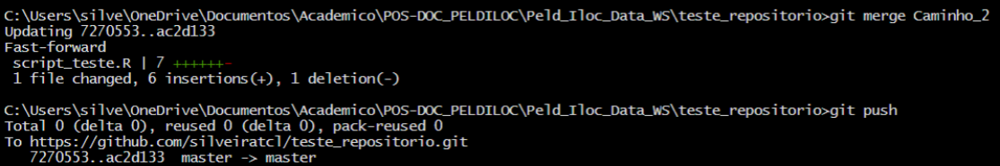

```{r setup, include=FALSE}
knitr::opts_chunk$set(echo = TRUE)

library(tidyverse)
library(ggmap)
library(maps)
library(mapdata)

```

## Website no GitHub

[Github Pages](https://pages.github.com) allows you to serve up simple websites from your Github repo. Let's turn on this feature by visiting the **Settings** tab in `https://github.com/USER/r3-exercises`. Then click the **Pages** menu from the left navbar, choose Branch: **main**, folder **/ (root)**:

`r img(src='figs/github_settings-pages.png', width=700)`

Click **Save**. You should now see that the site is "ready to be published":

`r img(src='figs/github_settings-pages-saved.png', width=700)`

You should now be able to visit the website URL:

-   `https://USER.github.io/r3-exercises`

Notice how the URL is a slight rearrangement of your Github repo URL:

-   `https://github.com/USER/r3-exercises`

For easily referencing the website, I recommend returning to the Github repo `https://github.com/USER/r3-exercises`, clicking the upper right **About** cog and adding it to the **Website** entry:

`r img(src='figs/github_about-website.png', width=500)`

You should now see a handy link to get to your website similar to this:

`r img(src='figs/github_about-website-saved.png', width=300)`


```{r dados}

# ocorrencias <- read.csv("data/occ_GBIF-OBIS_par_hepa.csv", header = TRUE)

```


```{r}
# # investigar niveis suspeitos
# world <- map_data("world")
# 
# head(world)
# 
# 
# # mapa
# ggplot() +
#   geom_polygon(data = world, aes(x = long, y = lat, group = group)) +
#     coord_fixed() +
#     theme_classic()

```


```{r}

# mapa + ocorrencias
# ggplot() +
#   geom_polygon(data = world, aes(x = long, y = lat, group = group)) +
#   coord_fixed() +
#   theme_classic() +
#   geom_point(data = ocorrencias, aes(x = decimalLongitude, y = decimalLatitude, color = datasetName)) +
#   theme(legend.title = element_blank()) +
#   labs(x = "longitude", y = "latitude", title = expression(italic("Paracanthurus hepatus")))

```


```{r}

# ggplot() +
#   geom_polygon(data = world, aes(x = long, y = lat, group = group)) +
#   coord_fixed() +
#   theme_classic() +
#   geom_point(data = ocorrencias, aes(x = decimalLongitude, y = decimalLatitude, color = datasetName, size = depth)) +
#   #theme(legend.title = element_blank()) +
#   labs(x = "longitude", y = "latitude", title = expression(italic("Paracanthurus hepatus")))

```

leaflet() %>% 
  addTiles() %>% 
  addMarkers(~decimalLongitude, ~decimalLatitude, 
             popup = ~as.character(datasetName), 
             label = ~as.character(scientificName),
             clusterOptions = markerClusterOptions())

```{r}

# ggplot() +
#   theme_classic() +
#   geom_point(data = ocorrencias, aes(x = decimalLatitude, y = depth, color = datasetName)) #+
#   #theme(legend.title = element_blank()) +
#   #labs(x = "longitude", y = "latitude", title = expression(italic("Paracanthurus hepatus")))

```

### Datasets form Bio-Oracle
layers_BO <- sdmpredictors::list_layers("Bio-ORACLE") 
layers_BO %>% 
  dplyr::select(name, layer_code) %>% 
  filter(name %in% c("Phosphate concentration (mean at max depth)",
                     "Nitrate concentration (mean at max depth)",
                     "Light at bottom (mean at max depth)",
                     "Iron concentration (mean at max depth)",
                     "Dissolved oxygen concentration (range at max depth)",
                     "Dissolved oxygen concentration (minimum at max depth)",
                     "Dissolved oxygen concentration (mean at max depth)",
                     "Current velocity (mean at max depth)",
                     "Sea water temperature (mean at max depth)",
                     "Primary production (mean at max depth)",
                     "Sea water salinity (mean at max depth)",
                     "Silicate concentration (mean at max depth)",
                     "Sea surface temperature (mean)"))

options(sdmpredictors_datadir = "data/Bio-Oracle/")

### Download environmental data layers (Max. Temperature, Min. Salinity and Min. Nitrates at the sea bottom)
## load from server
# environment.bottom <- load_layers(layercodes = c("BO2_curvelmean_bdmax", "BO2_dissoxltmax_bdmax", "BO2_salinitymean_bdmax", "BO2_tempmean_ss", "BO_calcite", "BO21_tempmean_bdmax"), 
#             equalarea=FALSE, rasterstack=TRUE)

## load local source
environment.bottom <- sdmpredictors::load_layers(c("BO_bathymean", "BO2_curvelmean_bdmax", "BO2_dissoxltmax_bdmax", "BO2_salinitymean_bdmax", "BO2_tempmean_ss", "BO_calcite", "BO21_tempmean_bdmax"), rasterstack=TRUE)

### SITES
### extract from rasters

##
library(sp)
my.sites1 <- ocorrencias
coordinates(my.sites1)=~decimalLongitude+decimalLatitude
SpatialPoints(my.sites1, proj4string = CRS("+proj=longlat +datum=WGS84"))
points <- SpatialPoints(my.sites1, proj4string=CRS(proj4string(environment.bottom)))

# environmental
library(raster)
store_data1 <- list()
for (i in 1:nlayers(environment.bottom)){
  store_data1[[i]] = extract(environment.bottom[[i]], points, buffer = 10,
                                     fun=mean,         # what to value to extract
                                     df=F)
}

names(store_data1) = names(environment.bottom)
marine_data <- bind_cols(ocorrencias, as_tibble(store_data1)) %>% 
  mutate(BO_bathymean = ifelse(BO_bathymean > 0, BO_bathymean*-1, BO_bathymean))

write.csv(marine_data, "data/raster_data_par_hepa.csv", row.names = FALSE)


***
## Workflow RStudio/Github

Nesta próxima etapa, vamos continuar a testar novas ferramentas do `GitHub` e usar comandos para testar novos caminhos sem alterar o repositório principal (`branch` e `merge`), além de começar a colaborar com outros usuários (`fork`, `branch`, `pull request` e `merge`).


PS: este tutorial de Git e GitHub foi adaptado do material criado pelos
colegas [Thiago Silveira](https://peld-iloc.github.io/Peld_Iloc_Data_WS/github.html#4_Git) e [Ben Best](https://noaa-iea.github.io/r3-train/collaborate.html).
<br><br>


### Intermediário: `branch` e `merge`

Os comandos `branch` e `merge` são muito úteis quando queremos testar diferentes caminhos. Imagine que você quer fazer uma figura e segue uma linha de raciocínio. Depois de se deparar com o resultado final, você percebe que poderia seguir um caminho diferente. Para não perder a primeira versão, que está no ramo **master**, você pode criar um `branch` , uma diferente abordagem em paralelo. Abaixo um resumo que que será realizado nesta seção:

|         Comando          |                    Ação                    |
|:------------------------:|:------------------------------------------:|
| `branch`  |   Cria um novo "ramo" em seu repositório   |
|  `merge`  | Incorporar um ramo criado ao ramo "master" |

<br><br>

O comando git no terminal é `git branch`. No RStudio você pode criar um
novo `branch` clicando botão como indicadoi abaixo.

 <br><br>

Depois de criar o novo `branch`  nomeado **Caminho_2**,
foram realizadas algumas mudanças no script, fazendo um `commit` e `push` neste ramo. Depois disso, será feito um `merge` incorporando as modificações ao ramo
principal **master**. No RStudio é possível somente criar os ramos pela
aba **Git**, para fazer o `merge` você terá que usar linha de comando no **Terminal**. Note que na interface de `commit`, temos sempre que preencher o campo **commit message**. Abaixo, em verde, são destacadas as mudanças realizadas, vermelho a versão anterior.

 <br><br>

Para fazer o merge do ramo **Caminho_2**, primeiro você precisa voltar
para o ramo **master**. Na aba git do RStudio troque de **Caminho_2**
para **master**. Depois disso digite os seguintes comandos no
**Terminal**, um de cada vez.

```{r, eval = FALSE}
# Fazendo o "merge" de "Caminho_2" ao "master"
git merge Caminho_2

# Fazendo o "push" para o repositório
git push

```

Você verá na aba **Terminal** algo semelhante a figura abaixo.

 <br><br>

Voltando para o repositório no **Github** podemos visualizar a versão
atualizada, mais **upstream** do repositório no ramo `master`.

 <br><br>


### Avançado: `fork`, `branch`, `pull request` e `merge`

Agora que já vimos como fazer as principais ações usando o **Git** e
**Github**, a partir deste ponto podemos executar um grupo de comandos
que consiste na grande vantagem de se usar o **Github**: a colaboração
com controle de versão. Abaixo um resumo dos comandos abordados:

|          Comando           |                    Ação                    |
|:--------------------------:|:------------------------------------------:|
|    `fork`     |        Copia um diretório do Github        |
|  `branch`   |   Cria um novo "ramo" em seu repositório   |
| `pull request`  |         Solitação de contribuição          |
|   `merge`   | Incorporar um ramo criado ao ramo "master" |

<br><br>

Para colaborar em um repositório você antes de mais nada copiar os
arquivos para o seu **Github**. Essa ação é executada com o comando
`fork`. Por exemplo, se dirija ao [respositório de
teste](https://github.com/peld-iloc/repo_test) e localize no alto da
página o botão `fork`. Depois escolha onde você gostaria
de colocar, escolha seu usuário. No canto esquerdo da página mostrará
que o repo está em seu usuário também.

 <br><br>

Agora faça novamente os passos descritos em **4.2 Criando repositório no
GitHub (ou REPO)**. Tenha certeza de criar uma nova pasta fora das
pastas que você já está trabalhando.

Faça alguma alteração no script, insira uma linha de código, depois faça
`commit`  e `push` . Note que seu
repositório será atualizado. Navegue até o [respositório de
teste](https://github.com/peld-iloc/repo_test) recém clonado e clique em
**Contribute**.

 <br><br>

Aparecerá uma nova página comparando o script antigo com o novo.

 <br><br>

Clique em **Create pull request**. Com o objetivo de facilitar a
colaboração, é eficiente você comentar o objetivo da sua contribuição.

 <br><br>

Clique novamente no botão **Create pull request** para confirmar sua
contribuição. Visualize a página
<https://github.com/peld-iloc/repo_test> e veja como ficou.

 <br><br>

Agora que você fez um `pull request`, basta você aguardar o
adminstrador do repositório analisar sua sugestão e fazer o `merge`
no ramo **master**.

Esse foi um exercício simples de colaboração usando Git e Github. Para
mais informações sobre o workflow usando o Github, acesse [Github
Guides](https://guides.github.com/introduction/flow/). Um guia muito
útil também é o [Happy Git and Github for the
useR](https://happygitwithr.com/).

------------------------------------------------------------------------

