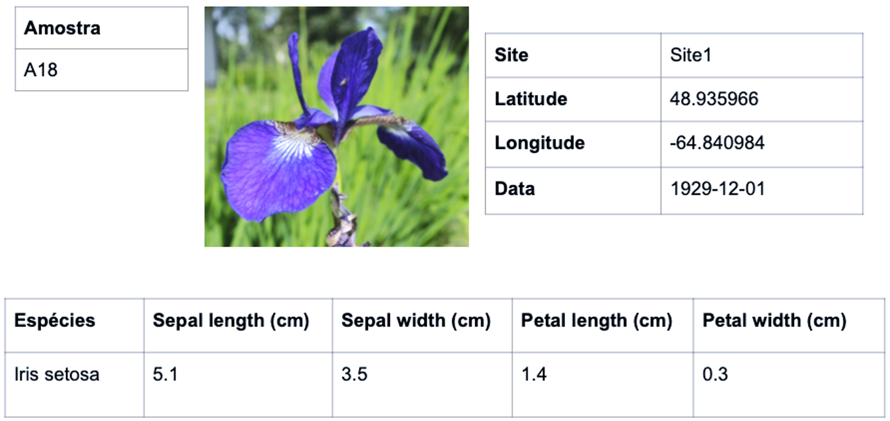
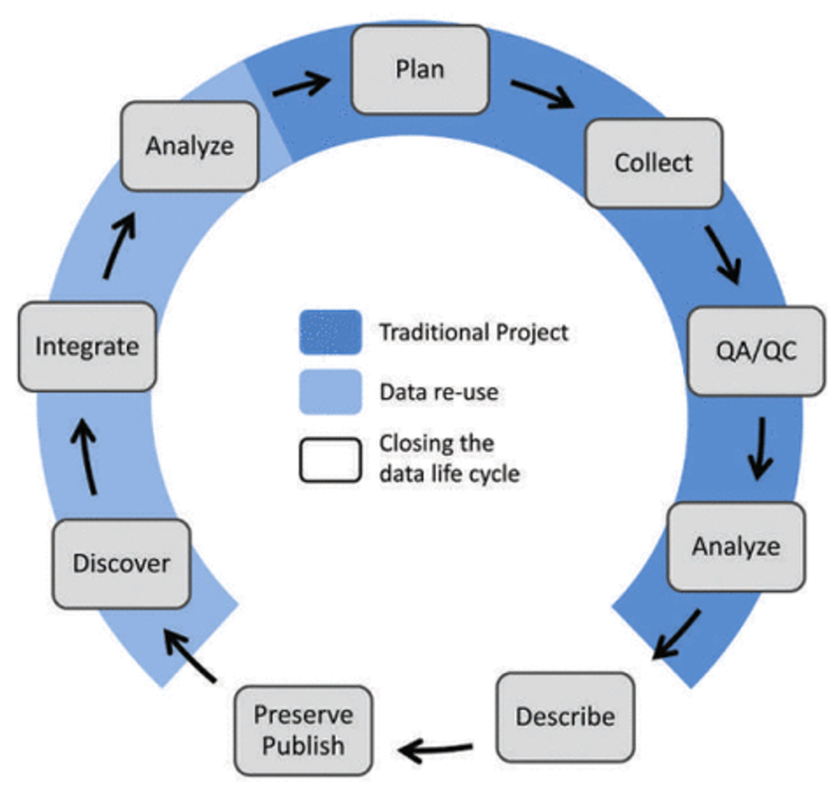

## Atividade 1 {.unnumbered}
  

  

A [**atividade 1**](atividade1.html) consiste em um exercício de construção de uma base de dados (planilha) a partir de dados coletados em campo descritos em *fichas de campo* simuladas com dados derivados do trabalho de Edgar Anderson (Anderson E. 1935. The irises of the Gaspe Peninsula, *Bulletin of the American Iris Society*, 59: 2--5).
  

***

## Atividade 2 {.unnumbered}

A atividade 2 será realizada para padronizar os dados gerados na atividade 1 usando o sistema [Darwin Core](https://dwc.tdwg.org/) e criar os arquivos necessários para distribuição dos dados como [Darwin Core Arquive](https://classroom.oceanteacher.org/pluginfile.php/15953/mod_resource/content/1/OBIS%20standards%20and%20formating.pdf).
  

***

## Atividade 3 {.unnumbered}

  

A atividade 3 inclui exercícios para a criação de uma rotina em R para a aquisição de dados em bases abertas, neste caso, utilizando-se o [GBIF](https://www.gbif.org/). Além disso, serão apresentadas ferramentas para conferência e limpeza de dados.
  

***

## Atividade 4 {.unnumbered}

  

A atividade 4 é uma extensão da atividade 3, onde os participantes terão de traduzir a rotina criada em R para uma rotina comentada em RMarkdown indicando detalhes a respeito do processo de aquisição e limpeza dos dados.
Na segunda parte da atividade, serão testadas ferramentas de compartilhamento no [GitHub](https://github.com/).
  

***

## Atividade 5 {.unnumbered}

  

A atividade 5 finaliza o processo de ferramentas básicas de compartilhamento e reprodutibilidade de dados científicos. Nesta atividade, os participantes irão tranformar as rotinas criadas nas atividades anteriores em um website além de incluir alguns `chunck` de recursos interativos.
  

***