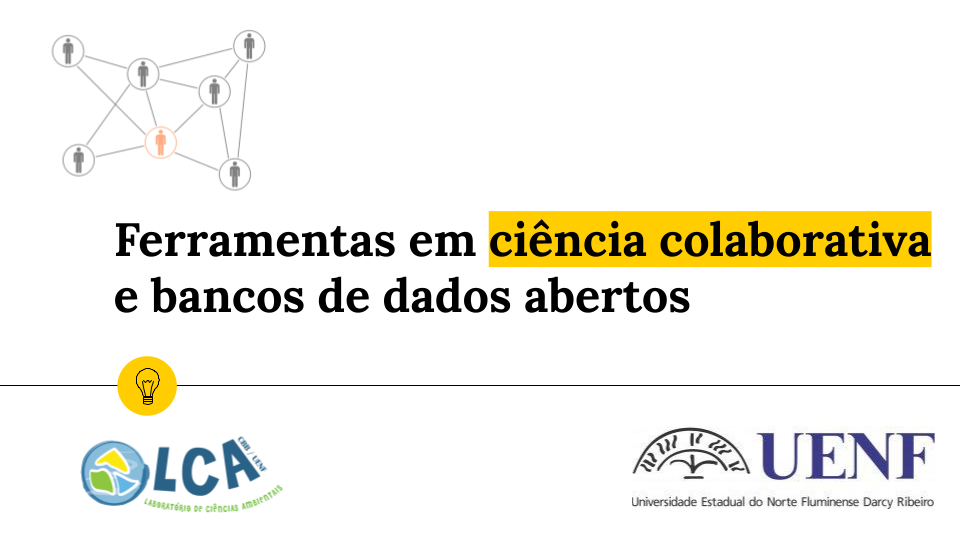

```{=html}
<style>
body {
text-align: justify}
</style>
```
## **Materiais**

------------------------------------------------------------------------

<center> <br><br></center>

#### O link a seguir leva ao Google Drive da disciplina e contém o material de apoio ao curso.

#### Clique [aqui](https://drive.google.com/drive/folders/1M0_GpzSro2MpQa1RmGZilbMZIkLTSGa8?usp=sharing) para acessar drive com o material do curso. Navegue pelas pastas para explorar o conteúdo.

<br></br>

### **Debate de artigos científicos**
<br></br>

1\. **Debate 1**

-   [**Albagli et al. (2014)** Ciência Aberta: correntes interpretativas e tipos de ação](https://drive.google.com/drive/folders/1gQ8BQVyDHW78pu3pKjrzD3sQeJNaZ4Gm?usp=sharing)

2\. **Debate 2**

-   [**Reichman OJ et al. (2011)** Challenges and Opportunities of Open Data in Ecology. Science, 331:703-705](https://drive.google.com/drive/folders/1gQ8BQVyDHW78pu3pKjrzD3sQeJNaZ4Gm?usp=sharing)

-   [**Kadakia KT et al. (2021)** Leveraging Open Science to Accelerate Research. The New England Journal of Medicine, e61:1-3](https://drive.google.com/drive/folders/1gQ8BQVyDHW78pu3pKjrzD3sQeJNaZ4Gm?usp=sharing)

3\. **Debate 3**

-   [**Parker TH et al. (2016)** Transparency in Ecology and Evolution: Real Problems, Real Solutions. Trends in Ecology & Evolution, 31(9) 711-719](https://drive.google.com/drive/folders/1gQ8BQVyDHW78pu3pKjrzD3sQeJNaZ4Gm?usp=sharing)

-   [**Stosic et al. (2021)** Greater belief in science predicts mask-wearing behavior during COVID-19. Personality and Individual Differences, 176: 110769](https://drive.google.com/drive/folders/1gQ8BQVyDHW78pu3pKjrzD3sQeJNaZ4Gm?usp=sharing)

4\. **Debate 4**

-   [**Dutta et al. (2021)** Decolonizing Open Science: Southern Interventions. Journal of Communication, 71 (5): 803-826](https://drive.google.com/drive/folders/1gQ8BQVyDHW78pu3pKjrzD3sQeJNaZ4Gm?usp=sharing)

-   [**Carroll SR et al. (2020)** The CARE Principles for Indigenous Data Governance. Data Science Journal, 19(43):1-12](https://drive.google.com/drive/folders/1gQ8BQVyDHW78pu3pKjrzD3sQeJNaZ4Gm?usp=sharing)

5\. **Debate 5**

-   [**Gundersen OE et al. (2018)** On Reproducible AI:Towards Reproducible Research, and Digital Scholarship in AI Publications. AI Magazine, 39(3): 56-68.](https://drive.google.com/drive/folders/1gQ8BQVyDHW78pu3pKjrzD3sQeJNaZ4Gm?usp=sharing)

-   [**UNESCO (2021)** Recomendação da UNESCO sobre Ciência Aberta](https://drive.google.com/drive/folders/1gQ8BQVyDHW78pu3pKjrzD3sQeJNaZ4Gm?usp=sharing)

<br></br>
